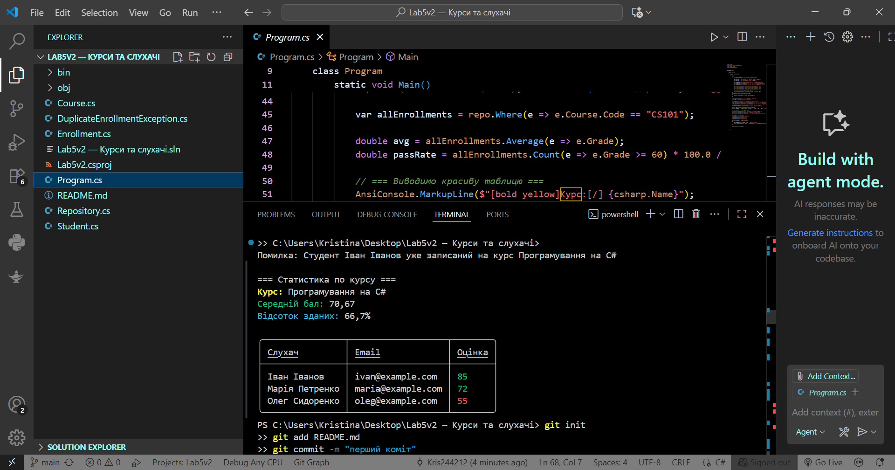

# Lab5v2 — Курси та слухачі
 Тема
Узагальнені типи, колекції, LINQ, обробка винятків.
 Сутності
- `Course` — курс.
- `Student` — слухач.
- `Enrollment` — зв’язок між студентом і курсом.
- `Repository<T>` — узагальнене сховище.
- `DuplicateEnrollmentException` — власний виняток.
Запуск
 Lab5v2 — Курси та слухачі  
 Тема
Узагальнені типи, колекції, LINQ, обробка винятків.
 Мета роботи
Ознайомитися з принципами створення узагальнених типів (Generics) у мові C#,  
навчитися використовувати колекції, LINQ-запити та механізми обробки винятків.
##  Сутності проєкту
- **Course** — курс.  
- **Student** — слухач.  
- **Enrollment** — зв’язок між студентом і курсом.  
- **Repository\<T\>** — узагальнене сховище даних.  
- **DuplicateEnrollmentException** — власний виняток при повторному записі.  
 Структура проєкту
Контрольні запитання

1. Що таке generics? Які їхні переваги?
Узагальнені типи (Generics) дозволяють створювати класи, методи й інтерфейси,
які працюють із будь-яким типом даних без дублювання коду.
Переваги: безпечність типів, швидкодія, універсальність, повторне використання коду.

2. Які основні відмінності між ArrayList і List<T>?
ArrayList зберігає елементи як object, тому вимагає приведення типів.
List<T> — типізована колекція, безпечна та швидка.

3. Чим відрізняється Dictionary<TKey,TValue> від List<T>?
List<T> — просто список елементів.
Dictionary<TKey, TValue> — колекція пар “ключ–значення”, що дозволяє швидкий пошук за ключем.

4. У чому перевага LINQ над класичними циклами?
LINQ дозволяє коротко та наочно писати запити до колекцій.
Код стає простішим, зрозумілішим і зручнішим для налагодження.

5. Як працює ключове слово finally?
Блок finally виконується завжди після try-catch, навіть якщо сталася помилка.
Використовується для закриття файлів, звільнення пам’яті тощо.

6. Коли доцільно створювати власні класи винятків?
Коли потрібно описати специфічну помилку програми.
Наприклад, DuplicateEnrollmentException сигналізує, що студент уже записаний на курс.

## 🖼️ Результати роботи

  

> *Рис. 1 — Вивід результатів програми у консолі.*

